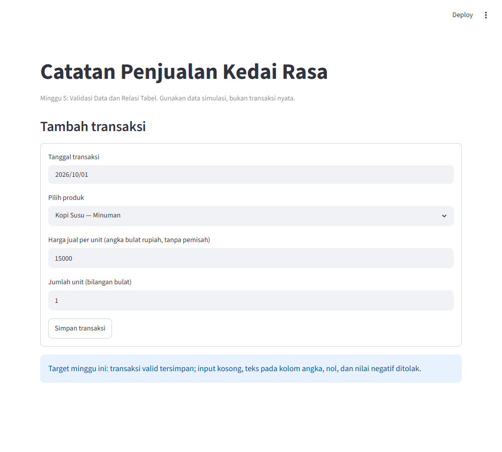
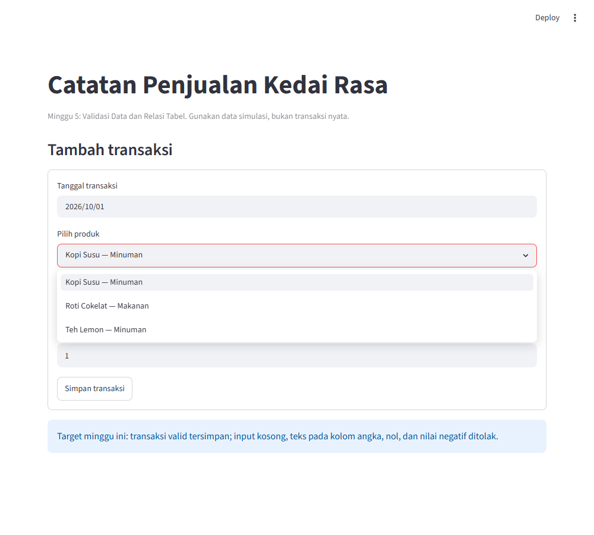
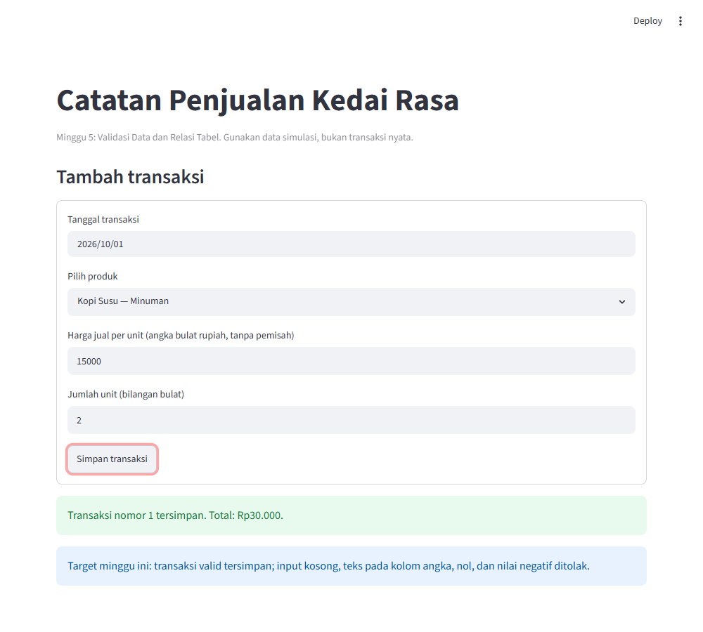
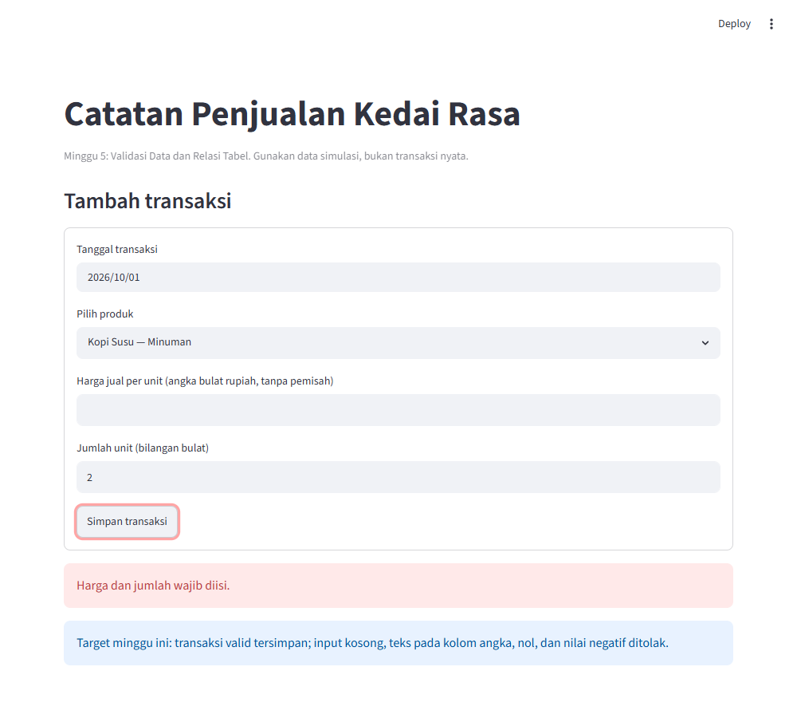
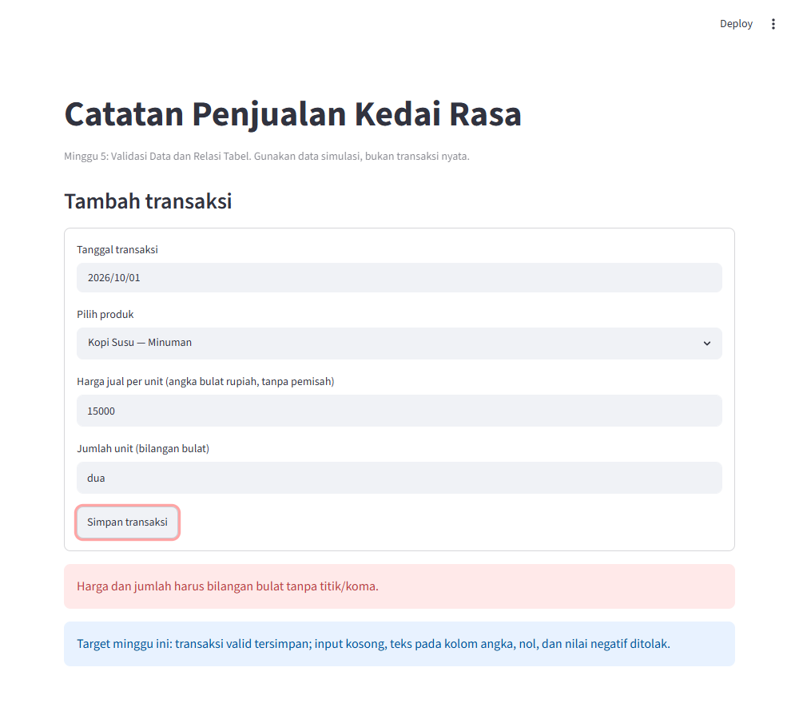
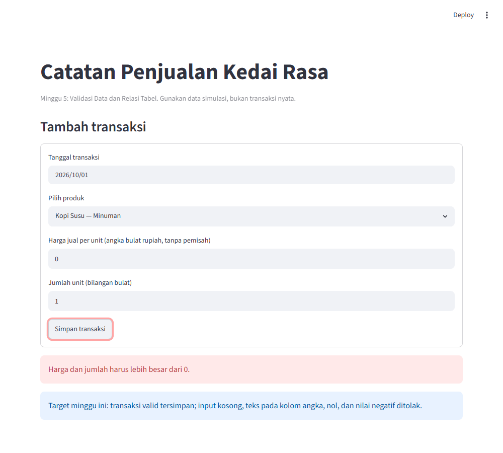

# Modul Praktik Minggu 5 — Validasi Data dan Relasi Tabel

| | |
|---|---|
| **Mata kuliah** | Pemrograman Data Bisnis |
| **Program Studi / Kelas** | Administrasi Bisnis — AB-2B |
| **Teknologi** | Python, Streamlit, VS Code, SQLite |
| **Alokasi waktu** | 2 pertemuan × 90 menit |
| **Studi kasus** | Catatan Penjualan Kedai Rasa (data simulasi) |
| **Berkas hasil akhir** | `app.py` (dijalankan dengan `streamlit run app.py`) |
| **Video tutorial** | [Tonton di YouTube](https://www.youtube.com/watch?v=jbA16hz8xzw) (±9 menit, dengan subtitle) |

---

> 🎬 **Lebih mudah belajar sambil menonton?** Ikuti video tutorial langkah demi langkah di sini: https://www.youtube.com/watch?v=jbA16hz8xzw. Gunakan modul ini sebagai pegangan untuk kode dan latihannya.

## Daftar Isi

1. [Gambaran Minggu Ini](#1-gambaran-minggu-ini)
2. [Konsep Dasar yang Perlu Dipahami](#2-konsep-dasar-yang-perlu-dipahami)
3. [Persiapan](#3-persiapan)
4. [Pertemuan 1 — Validasi Data](#4-pertemuan-1--validasi-data-90-menit)
5. [Pertemuan 2 — Relasi Tabel](#5-pertemuan-2--relasi-tabel-90-menit)
6. [Tugas Mandiri](#6-tugas-mandiri)
7. [Kriteria Selesai](#7-kriteria-selesai)
8. [Pertanyaan Refleksi](#8-pertanyaan-refleksi)
9. [Masalah Umum dan Cara Mengatasinya](#9-masalah-umum-dan-cara-mengatasinya)
10. [Glosarium](#10-glosarium)
11. [Lampiran — Kode Lengkap `app.py`](#11-lampiran--kode-lengkap-apppy)

---

## 1. Gambaran Minggu Ini

### 1.1 Masalah bisnis

Kedai Rasa mencatat penjualan harian. Bayangkan tiga kejadian ini terjadi di kasir:

| Kejadian | Akibat bila tidak dicegah |
|---|---|
| Kasir mengetik harga `0` atau `-15000` | Omzet hari itu terlihat lebih kecil dari kenyataan |
| Kasir mengetik jumlah `dua` (huruf, bukan angka) | Aplikasi error, transaksi hilang |
| Transaksi tercatat untuk produk yang tidak ada di katalog | Laporan per produk tidak bisa dibaca |

Satu data salah dapat membuat laporan salah, dan keputusan bisnis yang diambil dari laporan itu ikut salah. Prinsipnya:

> **Garbage in, garbage out** — data masuk yang buruk menghasilkan laporan yang buruk.

Karena itu data harus **diperiksa sebelum disimpan**.

### 1.2 Yang akan kita buat

Aplikasi web sederhana bernama **Catatan Penjualan Kedai Rasa** dengan satu form. Beginilah tampilannya saat pertama kali dibuka di browser:



*Gambar 1. Tampilan awal aplikasi: form dengan tanggal, pilihan produk, harga, jumlah, dan tombol simpan.*

- Data yang **benar** → tersimpan dan muncul pesan hijau (Gambar 3).
- Data yang **salah** → ditolak dengan pesan merah yang jelas (Gambar 4-6).

### 1.3 Tujuan pembelajaran

Setelah menyelesaikan modul ini, kamu mampu:

1. **Memvalidasi input** pengguna di Python: kosong, bukan angka, nol, dan negatif.
2. **Membuat aturan di database SQLite** (`NOT NULL`, `UNIQUE`, `CHECK`) sebagai pengaman kedua.
3. **Menghubungkan dua tabel** (`products` dan `sales`) dengan `FOREIGN KEY`, lalu membuktikan bahwa relasi itu ditegakkan.
4. **Menjelaskan** mengapa validasi perlu dilakukan di dua tempat (Python *dan* database).

### 1.4 Peta kegiatan

| Pertemuan | Fokus | Hasil yang kamu peroleh |
|---|---|---|
| **1** (90') | Validasi data | Database dengan aturan + fungsi validasi yang lulus uji |
| **2** (90') | Relasi tabel | Form simpan transaksi + bukti bahwa database menolak data yang melanggar aturan dan relasi |

---

## 2. Konsep Dasar yang Perlu Dipahami

Baca bagian ini sekali di awal. Jangan khawatir bila belum paham semuanya; setiap konsep akan kamu praktikkan.

### 2.1 Dua penjaga data

Data melewati dua "penjaga" sebelum masuk ke penyimpanan:

```
Pengguna ──► [ Penjaga 1: Python ] ──► [ Penjaga 2: Database ] ──► Data tersimpan
              validate_sale_inputs()     CHECK, NOT NULL, FOREIGN KEY
              memberi pesan ramah         menolak apa pun yang melanggar aturan
```

| | Penjaga 1: Python | Penjaga 2: Database |
|---|---|---|
| Fungsi | Memberi pesan yang mudah dipahami kasir | Menjamin data **tidak pernah** salah, apa pun jalur masuknya |
| Contoh | "Harga dan jumlah harus lebih besar dari 0." | `CHECK constraint failed: unit_price > 0` |
| Kelemahan | Bisa terlewat jika ada program lain yang menulis ke database | Pesannya teknis, kurang ramah |

Keduanya saling melengkapi, jadi **dua-duanya dipakai**.

### 2.2 Aturan di dalam tabel (constraint)

| Aturan | Artinya | Contoh dalam proyek ini |
|---|---|---|
| `PRIMARY KEY` | Nomor unik tiap baris | `id` pada `products` dan `sales` |
| `NOT NULL` | Kolom wajib diisi | `sale_date`, `product_id` |
| `UNIQUE` | Tidak boleh ada nilai kembar | `name` produk |
| `CHECK (...)` | Nilai harus memenuhi syarat | `unit_price > 0`, `total = unit_price * quantity` |
| `FOREIGN KEY` | Nilai harus menunjuk baris yang ada di tabel lain | `sales.product_id` → `products.id` |

### 2.3 Relasi tabel

Mengapa katalog produk dipisah dari transaksi? Perhatikan dua tabel berikut.

**Tabel `products` (katalog)**

| id | name | category | catalog_price |
|---|---|---|---|
| 1 | Kopi Susu | Minuman | 15000 |
| 2 | Roti Cokelat | Makanan | 10000 |
| 3 | Teh Lemon | Minuman | 12000 |

**Tabel `sales` (transaksi)**

| id | sale_date | product_id | unit_price | quantity | total |
|---|---|---|---|---|---|
| 1 | 2026-10-01 | **1** | 15000 | 2 | 30000 |
| 2 | 2026-10-01 | **3** | 12000 | 1 | 12000 |

- Transaksi hanya menyimpan **nomor produk** (`product_id`), bukan nama dan kategori yang diulang-ulang. Bila nama produk diperbaiki, cukup ubah di satu tempat.
- `product_id` pada `sales` adalah **foreign key** (kunci asing): ia harus menunjuk `id` yang benar-benar ada di `products`.
- Perhatikan `unit_price` di `sales`. Harga jual **disalin** saat transaksi terjadi, sehingga bila harga katalog naik bulan depan, transaksi lama tidak ikut berubah.

---

## 3. Persiapan

### 3.1 Prasyarat

- Python 3.10 atau lebih baru dan VS Code sudah terpasang.
- Streamlit sudah terpasang. Cek di terminal:

```bash
python --version
streamlit --version
```

Bila Streamlit belum ada:

```bash
pip install streamlit
```

### 3.2 Siapkan folder kerja

1. Buat folder baru bernama `Minggu5`.
2. Buka folder itu di VS Code (**File → Open Folder**).
3. Buat berkas kosong bernama `app.py`.
4. Buka terminal VS Code (**Terminal → New Terminal**) dan pastikan lokasinya di folder `Minggu5`.

### 3.3 Cara membaca modul ini

- Blok kode **bertanda `app.py`** ditambahkan ke berkas `app.py`, **di bawah** kode yang sudah ada, sesuai urutan.
- Blok kode **bertanda terminal** dijalankan di terminal.
- Kotak **Checkpoint** adalah titik pengecekan. Jangan lanjut sebelum checkpoint tercapai.
- Kotak **Coba sendiri** berisi percobaan kecil untuk memperdalam pemahaman.

---

## 4. Pertemuan 1 — Validasi Data (90 menit)

| Segmen | Durasi | Kegiatan |
|---|---|---|
| Pembukaan | 20' | Dosen menjelaskan masalah bisnis dan konsep (bagian 1 dan 2) |
| Langkah 1 | 10' | Pengaturan awal `app.py` |
| Langkah 2 | 25' | Membuat database dengan aturan |
| Langkah 3 | 20' | Menulis fungsi validasi |
| Langkah 4 | 10' | Menguji validasi di terminal (**Checkpoint 1**) |
| Refleksi | 5' | Diskusi singkat |

### Langkah 1 — Pengaturan awal (10 menit)

Tulis bagian pembuka berkas. Baris `import` adalah "alat" yang kita pinjam; bagian ini cukup disalin.

**`app.py`**

```python
"""
MINGGU 5 - VALIDASI DATA DAN RELASI TABEL
Studi kasus : Catatan Penjualan Kedai Rasa (data simulasi)
Cara menjalankan:  streamlit run app.py
"""

from contextlib import closing
from pathlib import Path
import sqlite3

import streamlit as st

# =====================================================================
# BAGIAN 1 - PENGATURAN DAN DATA CONTOH
# =====================================================================
DB_PATH = Path(__file__).with_name("penjualan_m5.db")  # file database
SEED_PRODUCTS = [  # katalog awal: (nama, kategori, harga katalog)
    ("Kopi Susu", "Minuman", 15000),
    ("Roti Cokelat", "Makanan", 10000),
    ("Teh Lemon", "Minuman", 12000),
]
```

| Baris | Maksudnya |
|---|---|
| `DB_PATH` | Lokasi file database `penjualan_m5.db`, yang berada di folder yang sama dengan `app.py` |
| `SEED_PRODUCTS` | Tiga produk awal untuk mengisi katalog. *Seed* berarti data bibit |

### Langkah 2 — Membuat database dengan aturan (25 menit)

Ini **inti materi** pertemuan 1. Tambahkan kode berikut di bawah kode sebelumnya.

**`app.py`**

```python
# =====================================================================
# BAGIAN 2 - DATABASE: TABEL, ATURAN, DAN RELASI
# =====================================================================
def get_connection():
    """Buka koneksi SQLite dan aktifkan pemeriksaan foreign key."""
    # Bagian teknis: cukup disalin, tidak perlu dipahami detailnya.
    connection = sqlite3.connect(DB_PATH)
    connection.row_factory = sqlite3.Row  # hasil query bisa dibaca per nama kolom
    # SQLite tidak memeriksa relasi kecuali diaktifkan dengan baris ini:
    connection.execute("PRAGMA foreign_keys = ON")
    return connection

def initialize_database():
    """Buat tabel products dan sales, lalu isi katalog contoh jika belum ada."""
    with closing(get_connection()) as connection:
        connection.executescript(
            """
            -- Tabel katalog: satu baris = satu produk
            CREATE TABLE IF NOT EXISTS products (
                id INTEGER PRIMARY KEY AUTOINCREMENT,  -- nomor unik produk
                name TEXT NOT NULL UNIQUE,             -- wajib diisi, tidak boleh kembar
                category TEXT NOT NULL,
                catalog_price INTEGER NOT NULL CHECK (catalog_price > 0)
            );
            -- Tabel transaksi: satu baris = satu penjualan
            CREATE TABLE IF NOT EXISTS sales (
                id INTEGER PRIMARY KEY AUTOINCREMENT,
                sale_date TEXT NOT NULL,
                product_id INTEGER NOT NULL,           -- produk apa yang dijual
                unit_price INTEGER NOT NULL CHECK (unit_price > 0),  -- harga harus > 0
                quantity INTEGER NOT NULL CHECK (quantity > 0),      -- jumlah harus > 0
                -- total harus sama dengan harga x jumlah:
                total INTEGER NOT NULL CHECK (total = unit_price * quantity),
                -- RELASI: product_id wajib ada di tabel products
                FOREIGN KEY (product_id) REFERENCES products(id)
            );
            """
        )
        connection.executemany(
            """
            INSERT OR IGNORE INTO products (name, category, catalog_price)
            VALUES (?, ?, ?)
            """,
            SEED_PRODUCTS,
        )
        connection.commit()

def get_products():
    """Ambil katalog untuk pilihan produk di form."""
    with closing(get_connection()) as connection:
        return connection.execute(
            "SELECT id, name, category, catalog_price FROM products ORDER BY name"
        ).fetchall()
```

**Cara membaca kode ini**

- Bagian `CREATE TABLE ...` adalah **bahasa SQL**. Kata setelah nama kolom (`INTEGER`, `TEXT`) adalah jenis datanya. Kata berikutnya (`NOT NULL`, `CHECK`) adalah aturannya.
- `IF NOT EXISTS` berarti "buat tabel hanya bila belum ada", jadi aman dijalankan berkali-kali.
- `INSERT OR IGNORE` berarti "isi katalog, tetapi lewati produk yang namanya sudah ada". Itulah gunanya `UNIQUE` pada `name`.
- Tanda `?` adalah tempat nilai. Nilainya diberikan terpisah (`SEED_PRODUCTS`), sehingga data tidak pernah digabung langsung ke teks SQL. Ini kebiasaan baik dan aman.
- `with closing(...)` memastikan koneksi ditutup otomatis setelah selesai dipakai.

**Tabel aturan pada `sales` (hafalkan, ini inti minggu ini)**

| Kolom | Aturan | Arti bisnis |
|---|---|---|
| `sale_date` | `NOT NULL` | Setiap transaksi wajib punya tanggal |
| `product_id` | `NOT NULL` + `FOREIGN KEY` | Wajib ada, dan harus produk yang terdaftar |
| `unit_price` | `CHECK (unit_price > 0)` | Harga tidak boleh nol atau negatif |
| `quantity` | `CHECK (quantity > 0)` | Jumlah tidak boleh nol atau negatif |
| `total` | `CHECK (total = unit_price * quantity)` | Total harus konsisten dengan harga × jumlah |

### Langkah 3 — Menulis fungsi validasi (20 menit)

Sekarang penjaga pertama: fungsi yang memeriksa isian kasir **sebelum** ke database.

**`app.py`**

```python
# =====================================================================
# BAGIAN 3 - VALIDASI INPUT DI PYTHON (penjaga pertama)
# =====================================================================
def validate_sale_inputs(price_text, quantity_text):
    """Kembalikan (harga, jumlah, pesan_error); pesan_error None jika valid."""
    price_text = price_text.strip()
    quantity_text = quantity_text.strip()

    if not price_text or not quantity_text:
        return None, None, "Harga dan jumlah wajib diisi."

    try:
        price = int(price_text)
        quantity = int(quantity_text)
    except ValueError:
        return None, None, "Harga dan jumlah harus bilangan bulat tanpa titik/koma."

    if price <= 0 or quantity <= 0:
        return None, None, "Harga dan jumlah harus lebih besar dari 0."
    return price, quantity, None
```

**Alur pikir fungsi ini** (baca seperti diagram alir):

```
Terima teks harga & jumlah
        │
        ▼
Buang spasi di pinggir (.strip)
        │
        ▼
Kosong? ──ya──► "Harga dan jumlah wajib diisi."
        │tidak
        ▼
Bisa diubah jadi bilangan bulat? ──tidak──► "...harus bilangan bulat tanpa titik/koma."
        │ya
        ▼
Ada yang ≤ 0? ──ya──► "...harus lebih besar dari 0."
        │tidak
        ▼
Kembalikan (harga, jumlah, tidak ada error)
```

Fungsi selalu mengembalikan **tiga nilai**: `(harga, jumlah, pesan_error)`.

| Situasi | Hasil |
|---|---|
| Input benar | `(15000, 2, None)` |
| Input salah | `(None, None, "pesan kesalahan")` |

> Mengapa harga dan jumlah diminta sebagai **teks**, bukan kolom angka? Agar kita sendiri yang belajar memeriksa apa saja yang bisa diketik orang. Pada aplikasi sungguhan, kasir bisa mengetik apa pun.

### Langkah 4 — Menguji validasi di terminal (10 menit)

Fungsi sudah selesai, tetapi belum ada tampilannya. Uji dahulu lewat terminal. Pastikan terminal berada di folder `Minggu5`, lalu jalankan:

**terminal**

```bash
python -c "from app import validate_sale_inputs as v; print(v('15000', '2'))"
```

Hasil yang benar: `(15000, 2, None)`.

Sekarang lengkapi tabel uji berikut. Jalankan perintah di kolom ketiga untuk tiap baris, lalu **tulis hasilnya sendiri** dan bandingkan dengan kunci jawaban di bawah tabel.

| No | Skenario | Perintah (ganti isi `v(...)`) | Hasil kamu |
|---|---|---|---|
| 1 | Input benar | `v('15000', '2')` | |
| 2 | Harga kosong | `v('', '2')` | |
| 3 | Jumlah berisi huruf | `v('15000', 'dua')` | |
| 4 | Harga memakai titik | `v('15.000', '1')` | |
| 5 | Harga nol | `v('0', '1')` | |
| 6 | Jumlah negatif | `v('15000', '-3')` | |
| 7 | Hanya spasi | `v('   ', '1')` | |

<details>
<summary>Kunci jawaban (buka setelah mencoba)</summary>

| No | Hasil yang diharapkan |
|---|---|
| 1 | `(15000, 2, None)` |
| 2 | `(None, None, 'Harga dan jumlah wajib diisi.')` |
| 3 | `(None, None, 'Harga dan jumlah harus bilangan bulat tanpa titik/koma.')` |
| 4 | `(None, None, 'Harga dan jumlah harus bilangan bulat tanpa titik/koma.')` |
| 5 | `(None, None, 'Harga dan jumlah harus lebih besar dari 0.')` |
| 6 | `(None, None, 'Harga dan jumlah harus lebih besar dari 0.')` |
| 7 | `(None, None, 'Harga dan jumlah wajib diisi.')` |

</details>

> ✅ **Checkpoint 1.** Ketujuh skenario menghasilkan jawaban yang sama dengan kunci jawaban. Tunjukkan layar terminalmu kepada dosen sebelum pertemuan berakhir.

> 💡 **Coba sendiri.** Mengapa skenario 7 (hanya spasi) dianggap kosong? Apa yang terjadi bila baris `.strip()` kamu hapus? Coba, lalu kembalikan lagi.

### Refleksi akhir Pertemuan 1 (5 menit)

Diskusikan dengan teman sebelahmu:

1. Dari tujuh skenario uji, mana yang menurutmu **paling sering** terjadi di kasir sungguhan?
2. Bila Python sudah menolak harga nol, mengapa database **masih** perlu aturan `CHECK (unit_price > 0)`? (Jawabannya akan kamu buktikan di Pertemuan 2.)

---

## 5. Pertemuan 2 — Relasi Tabel (90 menit)

| Segmen | Durasi | Kegiatan |
|---|---|---|
| Ulasan | 5' | Mengulang Pertemuan 1 |
| Konsep | 15' | Relasi tabel (bagian 2.3), dijelaskan dosen |
| Langkah 5 | 25' | Menyimpan transaksi dan membuat form |
| Langkah 6 | 15' | Menguji aturan database (**Checkpoint 2**) |
| Langkah 7 | 15' | Menguji relasi tabel (**Checkpoint 3**) |
| Langkah 8 | 10' | Melihat data dari dua tabel (JOIN) |
| Penutup | 5' | Rangkuman dan tugas |

### Langkah 5 — Menyimpan transaksi dan membuat form (25 menit)

Tambahkan penyimpanan transaksi ke `app.py`.

**`app.py`**

```python
# =====================================================================
# BAGIAN 4 - MENYIMPAN TRANSAKSI (penjaga kedua: database)
# =====================================================================
def save_sale(sale_date, product_id, unit_price, quantity):
    """Simpan satu penjualan; database tetap memeriksa batasan nilainya."""
    total = unit_price * quantity
    with closing(get_connection()) as connection:
        try:
            cursor = connection.execute(
                """
                INSERT INTO sales
                    (sale_date, product_id, unit_price, quantity, total)
                VALUES (?, ?, ?, ?, ?)
                """,
                (sale_date, product_id, unit_price, quantity, total),
            )
            connection.commit()
            return cursor.lastrowid
        except sqlite3.IntegrityError:
            # Database menolak data yang melanggar aturan (CHECK/FOREIGN KEY).
            connection.rollback()  # batalkan penyimpanan
            raise  # teruskan error ke tampilan agar pesannya bisa ditampilkan
```

Poin penting:

- `total` **dihitung oleh program** (`harga × jumlah`), bukan diketik kasir. Dengan begitu total selalu konsisten.
- Bila database menolak data (`IntegrityError`), kita batalkan (`rollback`) dan teruskan (`raise`) agar bagian tampilan bisa memberi tahu kasir.
- `cursor.lastrowid` adalah nomor transaksi yang baru dibuat.

Terakhir, tambahkan tampilan Streamlit.

**`app.py`**

```python
# =====================================================================
# BAGIAN 5 - TAMPILAN STREAMLIT
# =====================================================================
def main():
    st.set_page_config(page_title="Kedai Rasa — Minggu 5", layout="wide")
    st.title("Catatan Penjualan Kedai Rasa")
    st.caption(
        "Minggu 5: Validasi Data dan Relasi Tabel. "
        "Gunakan data simulasi, bukan transaksi nyata."
    )

    initialize_database()
    products = get_products()
    if not products:
        st.error("Katalog produk kosong. Minta bantuan dosen sebelum melanjutkan.")
        return

    product_by_id = {int(product["id"]): product for product in products}
    product_ids = list(product_by_id)

    st.subheader("Tambah transaksi")
    with st.form("sale_form"):
        sale_date = st.date_input("Tanggal transaksi")
        product_id = st.selectbox(
            "Pilih produk",
            options=product_ids,
            format_func=lambda item_id: (
                f"{product_by_id[item_id]['name']} — "
                f"{product_by_id[item_id]['category']}"
            ),
        )
        price_text = st.text_input(
            "Harga jual per unit (angka bulat rupiah, tanpa pemisah)",
            value="15000",
        )
        quantity_text = st.text_input("Jumlah unit (bilangan bulat)", value="1")
        submitted = st.form_submit_button("Simpan transaksi")

    if submitted:
        unit_price, quantity, error_message = validate_sale_inputs(
            price_text, quantity_text
        )
        if error_message:
            st.error(error_message)
        else:
            try:
                sale_id = save_sale(
                    sale_date.isoformat(), product_id, unit_price, quantity
                )
                st.success(
                    f"Transaksi nomor {sale_id} tersimpan. "
                    f"Total: Rp{unit_price * quantity:,}.".replace(",", ".")
                )
            except sqlite3.IntegrityError:
                st.error(
                    "Transaksi tidak tersimpan karena data tidak memenuhi "
                    "aturan database. Periksa kembali produk dan nilainya."
                )
    st.info(
        "Target minggu ini: transaksi valid tersimpan; input kosong, "
        "teks pada kolom angka, nol, dan nilai negatif ditolak."
    )


if __name__ == "__main__":
    main()
```

**Peta alur `main()`**

| Bagian kode | Fungsinya |
|---|---|
| `initialize_database()` | Menyiapkan tabel dan katalog |
| `get_products()` | Mengambil katalog untuk pilihan produk |
| `st.form(...)` | Membuat form: tanggal, produk, harga, jumlah, tombol |
| `validate_sale_inputs(...)` | **Penjaga 1**: periksa isian |
| `save_sale(...)` | **Penjaga 2**: simpan, database memeriksa aturan |
| `st.error` / `st.success` | Pesan merah / hijau untuk kasir |

> 💡 Kamu tidak perlu menghafal tiap baris `main()`. Yang penting: **form → validasi → simpan → pesan**.

Jalankan aplikasi:

**terminal**

```bash
streamlit run app.py
```

Browser terbuka otomatis. Bila tidak, buka alamat yang tertera di terminal (biasanya `http://localhost:8501`).

Setelah aplikasi terbuka, klik kotak **Pilih produk**. Daftar katalog dari tabel `products` akan muncul. Kasir hanya bisa memilih produk yang terdaftar:



*Gambar 2. Dropdown produk berisi katalog dari tabel `products`.*

Uji 4 skenario ini langsung di form. Gambar di bawah tabel menunjukkan **hasil yang harus kamu lihat**:

| No | Isi form | Hasil yang diharapkan |
|---|---|---|
| 1 | Harga `15000`, jumlah `2` | Pesan hijau: *Transaksi nomor 1 tersimpan. Total: Rp30.000.* |
| 2 | Harga dikosongkan | Pesan merah: *Harga dan jumlah wajib diisi.* |
| 3 | Jumlah `dua` | Pesan merah: *...harus bilangan bulat tanpa titik/koma.* |
| 4 | Harga `0` | Pesan merah: *...harus lebih besar dari 0.* |

**Skenario 1 — transaksi benar (pesan hijau):**



*Gambar 3. Harga 15000 × jumlah 2 → tersimpan sebagai transaksi nomor 1, total Rp30.000.*

**Skenario 2 — harga dikosongkan (pesan merah):**



*Gambar 4. Kolom harga kosong → ditolak: "Harga dan jumlah wajib diisi."*

**Skenario 3 — jumlah diisi huruf (pesan merah):**



*Gambar 5. Jumlah "dua" bukan bilangan bulat → ditolak.*

**Skenario 4 — harga nol (pesan merah):**



*Gambar 6. Harga 0 → ditolak: "Harga dan jumlah harus lebih besar dari 0."*

> Setiap kali transaksi benar disimpan, nomor transaksi bertambah. Bila nomor transaksimu bukan 1, itu wajar karena database menyimpan semua percobaanmu.

### Langkah 6 — Menguji aturan database (15 menit)

Sekarang kita buktikan jawaban pertanyaan refleksi nomor 2. Kita **sengaja melewati** penjaga Python dan menulis langsung ke database.

Buat berkas baru bernama `uji_database.py` di folder yang sama.

**`uji_database.py`**

```python
import sqlite3
from app import get_connection, initialize_database

initialize_database()

# (judul, produk_id, harga, jumlah, total)
percobaan = [
    ("Harga nol",           1,     0, 1,     0),
    ("Jumlah negatif",      1, 15000, -2, -30000),
    ("Total tidak cocok",   1, 15000, 2, 99999),
    ("Produk kosong",    None, 15000, 2, 30000),
]

for judul, produk_id, harga, jumlah, total in percobaan:
    # Koneksi baru tiap percobaan agar tidak saling mengganggu
    connection = get_connection()
    try:
        connection.execute(
            "INSERT INTO sales (sale_date, product_id, unit_price, quantity, total) "
            "VALUES ('2026-10-01', ?, ?, ?, ?)",
            (produk_id, harga, jumlah, total),
        )
        connection.commit()
        print(f"{judul:20} -> LOLOS (data tersimpan)")
    except sqlite3.IntegrityError as error:
        print(f"{judul:20} -> DITOLAK: {error}")
    finally:
        connection.close()
```

Jalankan:

**terminal**

```bash
python uji_database.py
```

Hasil yang diharapkan:

```
Harga nol            -> DITOLAK: CHECK constraint failed: unit_price > 0
Jumlah negatif       -> DITOLAK: CHECK constraint failed: quantity > 0
Total tidak cocok    -> DITOLAK: CHECK constraint failed: total = unit_price * quantity
Produk kosong        -> DITOLAK: NOT NULL constraint failed: sales.product_id
```

Bila kamu melihat `DITOLAK` empat kali, artinya aturan database bekerja **tanpa bantuan Python**.

> ✅ **Checkpoint 2.** Keempat percobaan ditolak oleh database. Salin hasil terminalmu ke lembar jawaban.

> 💡 **Coba sendiri.** Tambahkan satu percobaan kelima: `("Harga negatif", 1, -15000, 1, -15000)`. Pesan apa yang muncul?

### Langkah 7 — Menguji relasi tabel (15 menit)

Sekarang uji `FOREIGN KEY`. Produk nomor `99` tidak ada di katalog. Buat berkas `uji_relasi.py`.

**`uji_relasi.py`**

```python
import sqlite3
from app import DB_PATH, get_connection, initialize_database

initialize_database()

SQL = (
    "INSERT INTO sales (sale_date, product_id, unit_price, quantity, total) "
    "VALUES ('2026-10-01', 99, 15000, 2, 30000)"
)

# Percobaan A: koneksi proyek (foreign key AKTIF)
print("A. Foreign key aktif")
connection = get_connection()
try:
    connection.execute(SQL)
    connection.commit()
    print("   LOLOS (data tersimpan)")
except sqlite3.IntegrityError as error:
    print("   DITOLAK:", error)
finally:
    connection.close()

# Percobaan B: koneksi biasa tanpa PRAGMA (foreign key TIDAK aktif)
print("B. Foreign key tidak diaktifkan")
connection = sqlite3.connect(DB_PATH)
connection.execute(SQL)
connection.commit()
print("   LOLOS (data tersimpan)  <-- data yatim!")

# Bersihkan data percobaan B
connection.execute("DELETE FROM sales WHERE product_id = 99")
connection.commit()
connection.close()

# Percobaan C: menghapus produk yang sudah punya transaksi
print("C. Hapus produk yang sudah dipakai transaksi")
connection = get_connection()
try:
    connection.execute("DELETE FROM products WHERE id = 1")
    connection.commit()
    print("   LOLOS (produk terhapus)")
except sqlite3.IntegrityError as error:
    print("   DITOLAK:", error)
finally:
    connection.close()
```

> Percobaan C baru bermakna bila produk nomor 1 sudah punya transaksi. Pastikan kamu pernah menyimpan satu transaksi produk **Kopi Susu** lewat form di Langkah 5.

Jalankan:

**terminal**

```bash
python uji_relasi.py
```

Hasil yang diharapkan:

```
A. Foreign key aktif
   DITOLAK: FOREIGN KEY constraint failed
B. Foreign key tidak diaktifkan
   LOLOS (data tersimpan)  <-- data yatim!
C. Hapus produk yang sudah dipakai transaksi
   DITOLAK: FOREIGN KEY constraint failed
```

**Apa yang baru saja kamu buktikan?**

| Percobaan | Pelajaran |
|---|---|
| A | Dengan `PRAGMA foreign_keys = ON`, transaksi untuk produk yang tidak ada **ditolak** |
| B | Tanpa `PRAGMA`, SQLite **membiarkan** data yatim (transaksi yang menunjuk produk fiktif). Itulah sebabnya baris `PRAGMA` di `get_connection()` penting |
| C | Produk yang sudah punya transaksi **tidak bisa dihapus**, sehingga riwayat penjualan tetap utuh |

> ✅ **Checkpoint 3.** Percobaan A dan C ditolak, percobaan B lolos, dan kamu dapat menjelaskan alasannya dengan kata-katamu sendiri.

### Langkah 8 — Melihat data dari dua tabel (10 menit)

Data transaksi hanya menyimpan nomor produk. Untuk membaca nama produknya, kita **gabungkan** dua tabel dengan `JOIN`. Buat berkas `lihat_data.py`.

**`lihat_data.py`**

```python
from contextlib import closing
from app import get_connection, initialize_database

initialize_database()

query = """
    SELECT sales.id, sales.sale_date, products.name,
           sales.unit_price, sales.quantity, sales.total
    FROM sales
    JOIN products ON products.id = sales.product_id
    ORDER BY sales.id
"""

with closing(get_connection()) as connection:
    for row in connection.execute(query):
        print(
            f"#{row['id']} | {row['sale_date']} | {row['name']:<14} | "
            f"{row['quantity']} x Rp{row['unit_price']:,} = Rp{row['total']:,}"
        )
```

Jalankan dengan `python lihat_data.py`. Contoh hasil:

```
#1 | 2026-10-01 | Kopi Susu      | 2 x Rp15,000 = Rp30,000
```

Cara membaca `JOIN`: *"ambil setiap transaksi, lalu cari produk yang `id`-nya sama dengan `product_id` transaksi itu."* Kolom `name` ada di `products`, jadi tanpa `JOIN` namanya tidak bisa ditampilkan.

> Format di terminal memakai koma sebagai pemisah ribuan (`15,000`). Di aplikasi Streamlit kita menggantinya dengan titik. Format angka tidak memengaruhi data yang tersimpan.

### Penutup Pertemuan 2 (5 menit)

**Rangkuman: aturan bisnis dan penjaganya**

| Aturan bisnis | Dijaga di Python | Dijaga di Database |
|---|---|---|
| Harga dan jumlah wajib diisi | `validate_sale_inputs` | `NOT NULL` |
| Harga dan jumlah berupa bilangan bulat | `validate_sale_inputs` (`int(...)`) | Jenis kolom `INTEGER` |
| Harga dan jumlah lebih dari 0 | `validate_sale_inputs` | `CHECK (... > 0)` |
| Total = harga × jumlah | `save_sale` menghitung total | `CHECK (total = unit_price * quantity)` |
| Produk harus terdaftar | `selectbox` hanya menampilkan katalog | `FOREIGN KEY` |
| Nama produk tidak kembar | | `UNIQUE` |

**Kalimat kunci minggu ini**

> Python memberi pesan yang ramah kepada kasir; database memastikan data salah tidak pernah masuk, **siapa pun yang menulis ke sana**.

---

## 6. Tugas Mandiri

Kerjakan di rumah. Kumpulkan `app.py` beserta berkas uji yang kamu buat.

| No | Tugas | Tingkat |
|---|---|---|
| 1 | Tambahkan **satu produk baru** (misalnya *Nasi Goreng*, Makanan, 18000) ke `SEED_PRODUCTS`. Jalankan ulang aplikasi dan pastikan produk muncul di pilihan form. | Mudah |
| 2 | Tambahkan aturan validasi di Python: **jumlah maksimal 100 unit** per transaksi. Pesan: *"Jumlah maksimal 100 unit per transaksi."* Uji dengan jumlah `101`. | Sedang |
| 3 | Tambahkan aturan di database: `CHECK (quantity <= 100)` pada tabel `sales`. **Petunjuk:** `CREATE TABLE IF NOT EXISTS` tidak mengubah tabel yang sudah ada, jadi hapus berkas `penjualan_m5.db` dahulu agar tabel dibuat ulang. Buktikan dengan `uji_database.py` bahwa database menolak jumlah `101`. | Sedang |
| 4 | Tulis **laporan singkat** (3–5 kalimat): mengapa Python *dan* database sama-sama memeriksa jumlah? Berikan satu contoh nyata di bisnis kedai. | Sedang |
| 5 | **Tantangan:** buat `lihat_data.py` menampilkan **total omzet per produk** memakai `GROUP BY`. **Petunjuk:** `SELECT products.name, SUM(sales.total) FROM products LEFT JOIN sales ON sales.product_id = products.id GROUP BY products.id`. | Tantangan |

---

## 7. Kriteria Selesai

Centang setelah kamu yakin.

**Pertemuan 1**

- [ ] `app.py` memiliki fungsi `initialize_database` dan `validate_sale_inputs`.
- [ ] Ketujuh skenario uji validasi menghasilkan jawaban yang benar (Checkpoint 1).

**Pertemuan 2**

- [ ] Aplikasi berjalan dengan `streamlit run app.py` dan transaksi valid tersimpan.
- [ ] Input kosong, huruf, titik/koma, nol, dan negatif ditolak dengan pesan merah.
- [ ] `uji_database.py` menunjukkan empat penolakan dari database (Checkpoint 2).
- [ ] `uji_relasi.py` menunjukkan percobaan A dan C ditolak dan B lolos (Checkpoint 3).
- [ ] `lihat_data.py` menampilkan nama produk (bukan hanya nomor) lewat `JOIN`.

**Tugas mandiri**

- [ ] Tugas 1–4 selesai (tugas 5 bersifat tantangan).

---

## 8. Pertanyaan Refleksi

Jawab singkat (2–3 kalimat) di lembar jawaban.

1. Sebutkan tiga contoh data salah yang bisa terjadi di kasir, dan satu dampaknya pada laporan penjualan.
2. Mengapa validasi dilakukan di dua tempat (Python dan database)? Apa yang terjadi bila hanya salah satu yang ada?
3. Pada percobaan B, mengapa data transaksi untuk produk nomor 99 bisa tersimpan? Apa akibatnya bagi laporan penjualan per produk?
4. Mengapa tabel `sales` menyimpan `unit_price` sendiri, padahal tabel `products` sudah punya `catalog_price`?
5. Mengapa transaksi menyimpan `product_id`, bukan nama produknya langsung?

---

## 9. Masalah Umum dan Cara Mengatasinya

| Gejala | Penyebab | Solusi |
|---|---|---|
| `ModuleNotFoundError: No module named 'streamlit'` | Streamlit belum terpasang | Jalankan `pip install streamlit` |
| `'streamlit' is not recognized` | Perintah belum dikenali | Coba `python -m streamlit run app.py` |
| `ModuleNotFoundError: No module named 'app'` | Terminal tidak berada di folder `Minggu5`, atau nama berkas bukan `app.py` | Pindah ke folder yang benar (`cd Minggu5`) dan periksa nama berkas |
| Perubahan kode tidak terlihat di browser | Berkas belum disimpan | Simpan dengan `Ctrl + S`, lalu klik **Rerun** di browser |
| `IndentationError` | Spasi di awal baris tidak sejajar | Pastikan isi fungsi menjorok 4 spasi, dan jangan campur Tab dengan spasi |
| Tugas 3: aturan `CHECK` baru tidak berlaku | Tabel lama sudah ada, jadi tidak dibuat ulang | Hentikan aplikasi, hapus `penjualan_m5.db`, lalu jalankan lagi |
| `database is locked` | Database sedang dipakai program lain | Tutup skrip yang sedang berjalan, lalu coba lagi |
| Percobaan C di `uji_relasi.py` menunjukkan *LOLOS* | Produk nomor 1 belum punya transaksi | Simpan satu transaksi **Kopi Susu** lewat form, lalu ulangi |
| Pesan merah *"...tidak memenuhi aturan database"* pada transaksi yang tampak benar | Nilai melanggar salah satu `CHECK` | Periksa harga, jumlah, dan produk; bandingkan dengan tabel aturan di Langkah 2 |

**Cara mulai dari awal** (bila datamu berantakan): hentikan aplikasi dengan `Ctrl + C` di terminal, hapus berkas `penjualan_m5.db`, lalu jalankan lagi. Database dan katalog akan dibuat ulang otomatis.

---

## 10. Glosarium

| Istilah | Arti |
|---|---|
| **Validasi** | Memeriksa apakah data sesuai aturan sebelum diterima |
| **Integritas data** | Keadaan data yang benar, lengkap, dan konsisten |
| **Constraint** | Aturan yang dipasang pada kolom/tabel dan ditegakkan oleh database |
| **Primary key** | Kolom pengenal unik tiap baris (di sini `id`) |
| **Foreign key** | Kolom yang nilainya harus menunjuk primary key di tabel lain |
| **Relasi** | Hubungan antartabel melalui foreign key |
| **JOIN** | Perintah SQL untuk menggabungkan baris dari dua tabel |
| **Seed data** | Data awal untuk mengisi tabel supaya bisa langsung dipakai |
| **Data yatim** | Baris yang menunjuk data induk yang tidak ada (contoh: transaksi untuk produk nomor 99) |
| **Rollback** | Membatalkan perubahan yang belum disimpan permanen |
| **Commit** | Menyimpan perubahan secara permanen |
| **IntegrityError** | Kesalahan dari Python ketika database menolak data yang melanggar aturan |

---

## 11. Lampiran — Kode Lengkap `app.py`

Bila kodemu bermasalah, bandingkan dengan versi lengkap berikut. Isinya sama dengan gabungan Langkah 1, 2, 3, dan 5 (lihat berkas `app.py` pada folder proyek untuk versi dengan pembuka lengkap).

Susunan berkas yang benar:

| Urutan | Bagian | Kamu menulisnya di |
|---|---|---|
| 1 | Pembuka dan `import` | Langkah 1 |
| 2 | **Bagian 1** — Pengaturan dan data contoh | Langkah 1 |
| 3 | **Bagian 2** — Database (`get_connection`, `initialize_database`, `get_products`) | Langkah 2 |
| 4 | **Bagian 3** — Validasi (`validate_sale_inputs`) | Langkah 3 |
| 5 | **Bagian 4** — Menyimpan (`save_sale`) | Langkah 5 |
| 6 | **Bagian 5** — Tampilan (`main` dan `if __name__ ...`) | Langkah 5 |

Berkas pendukung yang kamu buat di modul ini:

| Berkas | Fungsi |
|---|---|
| `app.py` | Aplikasi utama |
| `uji_database.py` | Membuktikan database menolak harga/jumlah/total/produk yang salah |
| `uji_relasi.py` | Membuktikan foreign key bekerja (dan apa yang terjadi bila tidak aktif) |
| `lihat_data.py` | Menampilkan transaksi beserta nama produk lewat `JOIN` |

Gambar yang dipakai pada modul ini ada di folder `images/`:

| Berkas | Isi |
|---|---|
| `01_tampilan_awal.png` | Tampilan awal aplikasi |
| `02_pilihan_produk.png` | Dropdown katalog produk |
| `03_transaksi_berhasil.png` | Transaksi valid tersimpan |
| `04_error_kosong.png` | Penolakan: harga kosong |
| `05_error_huruf.png` | Penolakan: jumlah berisi huruf |
| `06_error_nol.png` | Penolakan: harga nol |
